# **Software Requirements Specification (SRS) - OGIM: Oil & Gas Intelligent Monitoring System**
**Version:** 2.0 | **Date:** November 2025 | **Status:** FINAL

---

## **1. Introduction**

### **1.1 Purpose**
This document specifies the complete software requirements for the **Oil & Gas Intelligent Monitoring (OGIM) System** - a comprehensive real-time monitoring, predictive analytics, and control platform for oil and gas field operations.

### **1.2 Scope**
OGIM provides end-to-end digital transformation for oil field operations including real-time monitoring, machine learning-driven predictive maintenance, intelligent alerting, and secure command/control capabilities.

### **1.3 Business Objectives**
- Reduce unplanned downtime by 40%
- Increase production efficiency by 15%
- Predictive maintenance cost reduction by 30%
- Real-time operational intelligence
- Enhanced safety compliance

---

## **2. System Overview**

### **2.1 Architecture Overview**

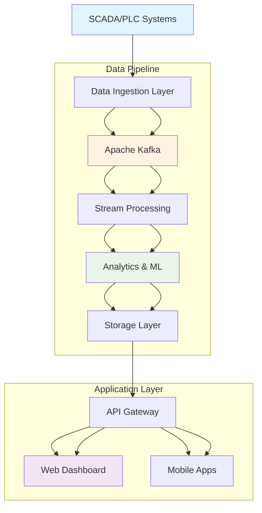

### **2.2 Technology Stack**

| Layer | Technology |
|-------|------------|
| **Frontend** | React 18, TypeScript, Vite, Recharts |
| **Backend** | FastAPI, Python 3.10+, SQLAlchemy |
| **Data Processing** | Apache Flink, Apache Kafka |
| **Databases** | PostgreSQL, TimescaleDB, Redis |
| **ML/AI** | Scikit-learn, MLflow, TensorFlow |
| **Infrastructure** | Docker, Kubernetes, NGINX |
| **Connectivity** | OPC UA, Modbus TCP |

---

## **3. Functional Requirements**

### **3.1 Data Acquisition & Ingestion**

#### **FR-101: Multi-Protocol Data Acquisition**
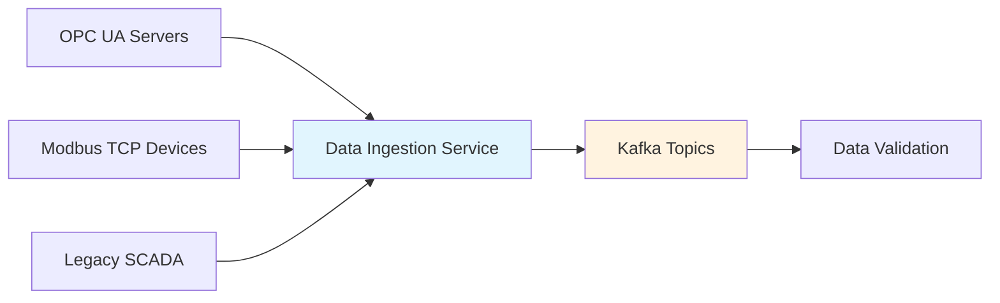

**Requirements:**
- Support OPC UA, Modbus TCP, REST APIs
- Handle 10,000+ data points per second
- Auto-reconnection with exponential backoff
- Data buffering during network outages
- Protocol-specific data transformation

#### **FR-102: Real-time Data Streaming**
- Ingest data from 65+ variables per well
- Support 1-second sampling intervals
- Handle 100+ concurrent data sources
- Real-time data validation and cleansing

### **3.2 Real-Time Monitoring (RTM)**

#### **FR-201: Dashboard Visualization**
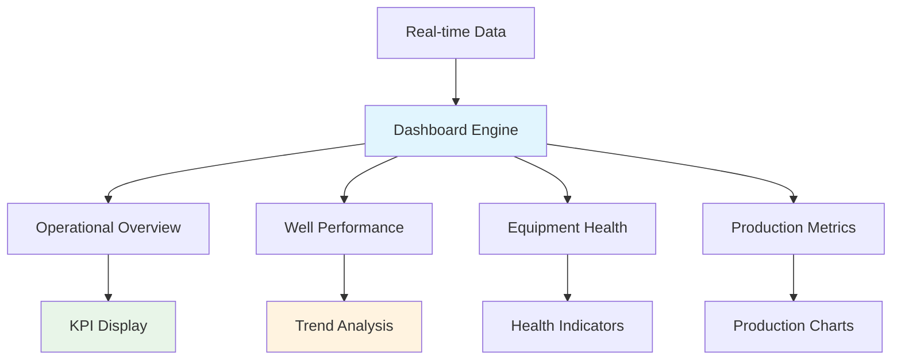

**Requirements:**
- Real-time data updates (1-10 second intervals)
- 65+ variable visualization per well
- Historical trend analysis (1-year data)
- Interactive charts and gauges
- Multi-well comparison views

#### **FR-202: Performance Monitoring**
- Production rate monitoring
- Equipment efficiency calculations
- Key performance indicators (KPIs)
- Real-time operational status

### **3.3 Predictive Maintenance (PdM)**

#### **FR-301: Machine Learning Pipeline**
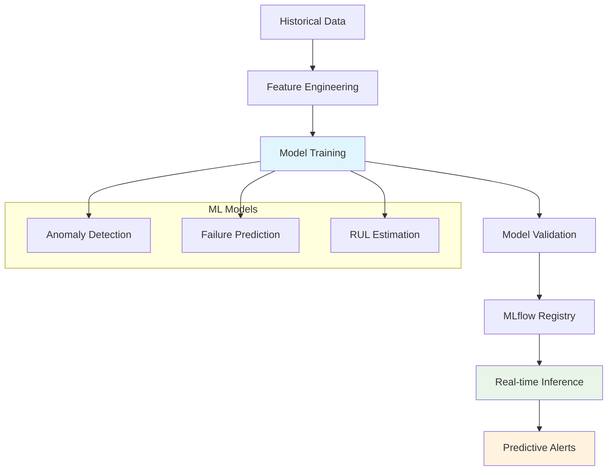

**Requirements:**
- Anomaly detection using Isolation Forest
- Equipment failure prediction (Random Forest)
- Remaining Useful Life (RUL) estimation
- Model retraining every 30 days
- A/B testing for model improvements

#### **FR-302: Maintenance Intelligence**
- Predictive maintenance scheduling
- Spare parts optimization
- Maintenance cost forecasting
- Work order generation

### **3.4 Data Validation & Reconciliation (DVR)**

#### **FR-401: Data Quality Framework**
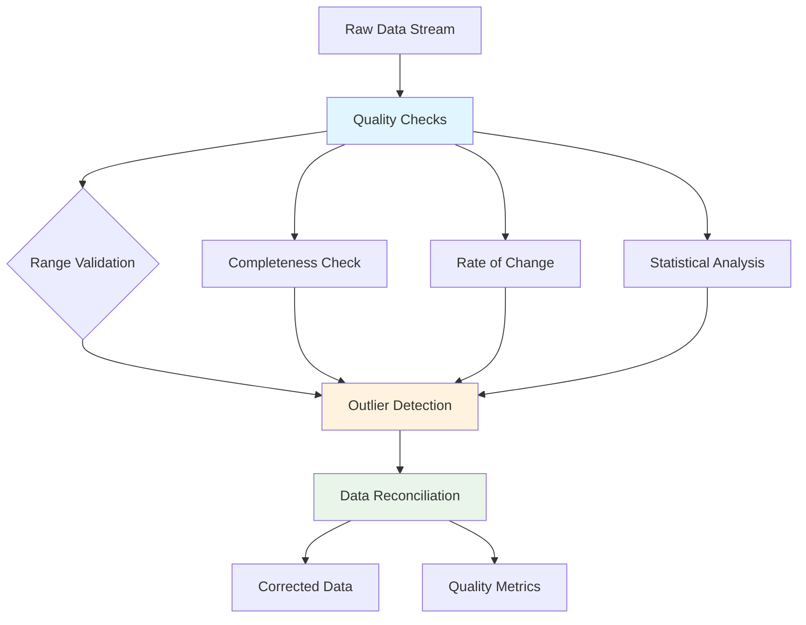

**Requirements:**
- Real-time data validation rules
- Statistical outlier detection
- Missing data imputation
- Data reconciliation algorithms
- Quality score calculation

#### **FR-402: Sensor Health Monitoring**
- Sensor drift detection
- Calibration scheduling
- Faulty sensor identification
- Automated sensor health scoring

### **3.5 Alert Management**

#### **FR-501: Intelligent Alerting**
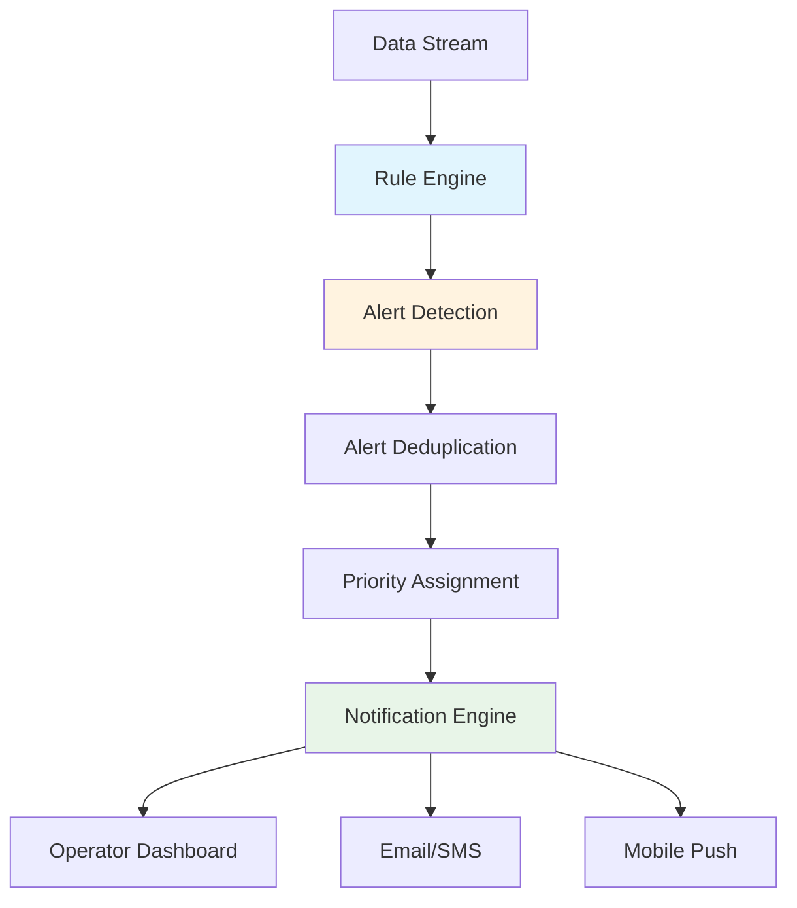

**Requirements:**
- Configurable alert rules
- Multi-level severity (Info, Warning, Critical)
- Alert deduplication and correlation
- Escalation policies
- Notification channels (Email, SMS, Push)

#### **FR-502: Alert Analytics**
- Alert history and trends
- False positive analysis
- Alert response time tracking
- Root cause analysis

### **3.6 Command & Control**

#### **FR-601: Secure Control System**
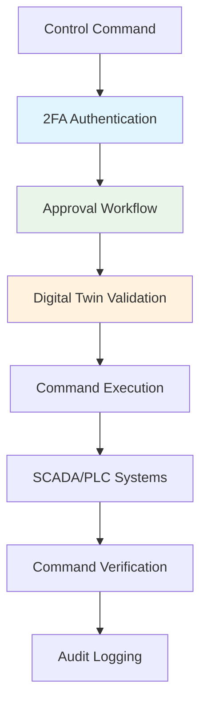

**Requirements:**
- Two-factor authentication for critical commands
- Multi-level approval workflows
- Digital twin simulation before execution
- Comprehensive audit logging
- Command rollback capabilities

#### **FR-602: Remote Operations**
- Setpoint adjustments
- Equipment start/stop commands
- Valve control operations
- Emergency shutdown procedures

---

## **4. Data Requirements**

### **4.1 Data Model Overview**

#### **DR-101: Well Data Structure**
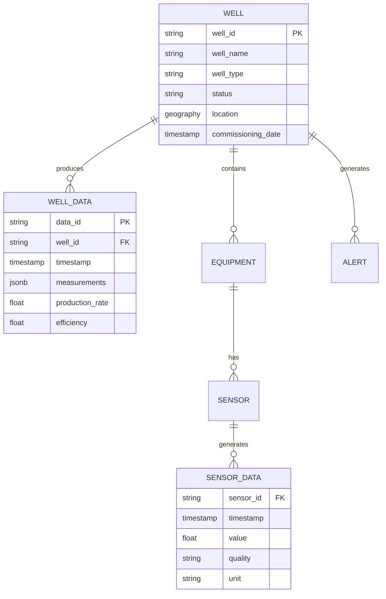

### **4.2 Data Volume Specifications**

| Data Type | Volume | Retention | Compression |
|-----------|--------|-----------|-------------|
| Real-time Sensor Data | 10 GB/day | 2 years | 90% (TimescaleDB) |
| Historical Analytics | 1 TB/year | 7 years | 70% (PostgreSQL) |
| Alert & Event Data | 100 MB/day | 5 years | 50% (PostgreSQL) |
| ML Model Data | 50 GB | Permanent | None |
| Audit Logs | 500 MB/day | 3 years | 80% (Elasticsearch) |

### **4.3 Data Variables (65+ Parameters)**

| Category | Parameters | Sampling Rate |
|----------|------------|---------------|
| **Pressure** | Wellhead, Tubing, Casing, etc. | 1 second |
| **Temperature** | Wellhead, Separator, Motor, etc. | 1 second |
| **Flow** | Oil, Gas, Water, Liquid | 1 second |
| **Composition** | Oil Cut, Water Cut, GOR | 5 seconds |
| **Vibration** | X/Y/Z axes, Overall | 100 milliseconds |
| **Electrical** | Voltage, Current, Power Factor | 1 second |
| **Environmental** | Temp, Pressure, Humidity | 10 seconds |

---

## **5. Non-Functional Requirements**

### **5.1 Performance Requirements**

#### **NF-101: System Performance**
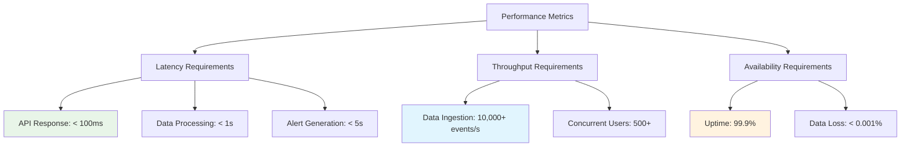

**Requirements:**
- API response time: < 100ms (95th percentile)
- Data processing latency: < 1 second
- Real-time dashboard updates: 1-10 seconds
- System availability: 99.9% uptime
- Concurrent users: 500+

### **5.2 Security Requirements**

#### **NF-201: Security Framework**
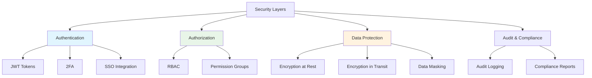

**Requirements:**
- JWT-based authentication
- Role-Based Access Control (RBAC)
- Two-factor authentication for critical operations
- Data encryption at rest and in transit
- Comprehensive audit logging
- SOC 2 compliance

### **5.3 Scalability Requirements**

#### **NF-301: Scalability Architecture**
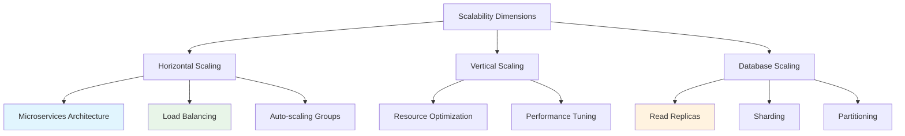

**Requirements:**
- Horizontal scaling for all microservices
- Database read replicas for analytics
- Time-series data partitioning
- Support for 100+ wells
- 10x data volume growth handling

### **5.4 Reliability Requirements**

- Mean Time Between Failures (MTBF): > 720 hours
- Mean Time To Repair (MTTR): < 1 hour
- Data backup and recovery: < 4 hours
- Disaster recovery: < 24 hours

---

## **6. Integration Requirements**

### **6.1 External System Integration**

#### **IR-101: SCADA/PLC Integration**
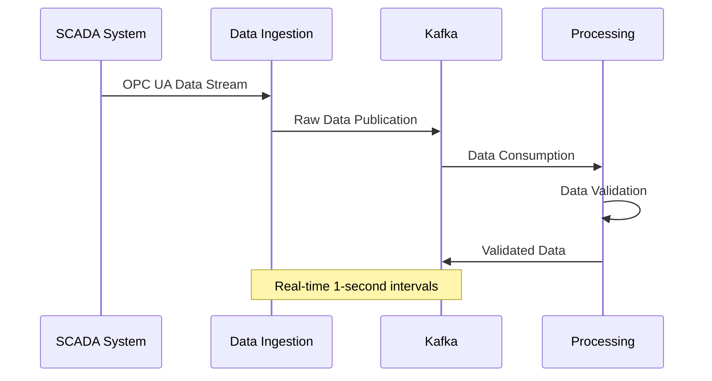

**Requirements:**
- OPC UA client connectivity
- Modbus TCP protocol support
- Legacy SCADA system integration
- Real-time data synchronization
- Protocol conversion and normalization

### **6.2 Third-Party Integrations**

- ERP systems (SAP, Oracle)
- Maintenance management systems
- Weather data services
- Regulatory reporting systems
- Mobile workforce applications

---

## **7. Deployment Architecture**

### **7.1 Infrastructure Overview**

#### **IR-201: Cloud Deployment**
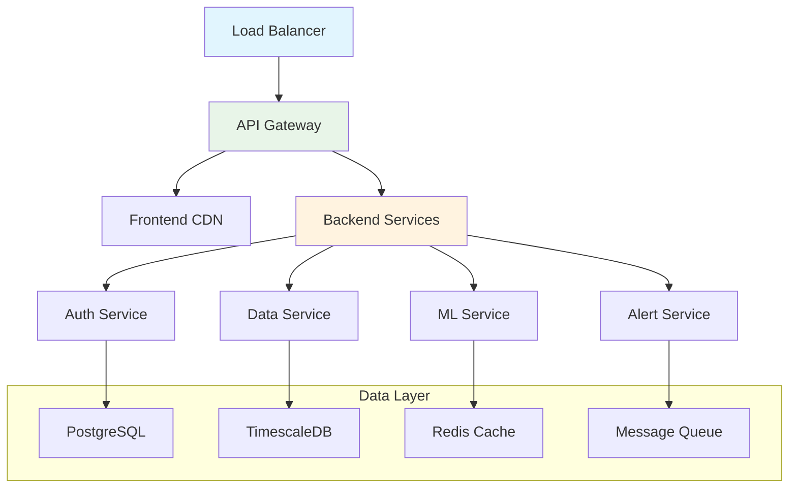

### **7.2 High Availability**

- Multi-availability zone deployment
- Database replication and failover
- Automated backup systems
- Monitoring and alerting
- Disaster recovery procedures

---

## **8. Compliance & Standards**

### **8.1 Regulatory Compliance**

- NORSOK standards compliance
- ISO 14224 (Petroleum reliability data)
- ISA-95 (Enterprise-control system integration)
- GDPR data protection requirements
- Local regulatory requirements

### **8.2 Industry Standards**

- OPC UA for industrial communication
- REST API design standards
- Microservices architecture patterns
- DevOps and CI/CD practices
- Agile development methodology

---

## **9. Testing Requirements**

### **9.1 Testing Strategy**

#### **TR-101: Comprehensive Testing**
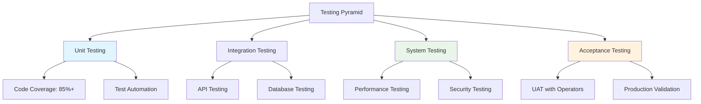

**Requirements:**
- Unit test coverage: 85% minimum
- Integration testing for all APIs
- Performance and load testing
- Security penetration testing
- User acceptance testing (UAT)

---

## **10. Maintenance & Support**

### **10.1 Operational Support**

- 24/7 monitoring and alerting
- SLAs for different priority levels
- Regular maintenance windows
- Patch and update management
- Performance optimization

### **10.2 Training & Documentation**

- Comprehensive user documentation
- Administrator guides
- API documentation
- Training materials for operators
- Troubleshooting guides

---

## **Appendices**

### **Appendix A: Data Dictionary**
Complete specification of all 65+ data variables with units, ranges, and sampling rates.

### **Appendix B: API Specifications**
Detailed REST API documentation with endpoints, request/response formats, and authentication.

### **Appendix C: Security Protocols**
Comprehensive security implementation details including encryption standards and access controls.

### **Appendix D: Deployment Guides**
Step-by-step deployment instructions for development, staging, and production environments.

