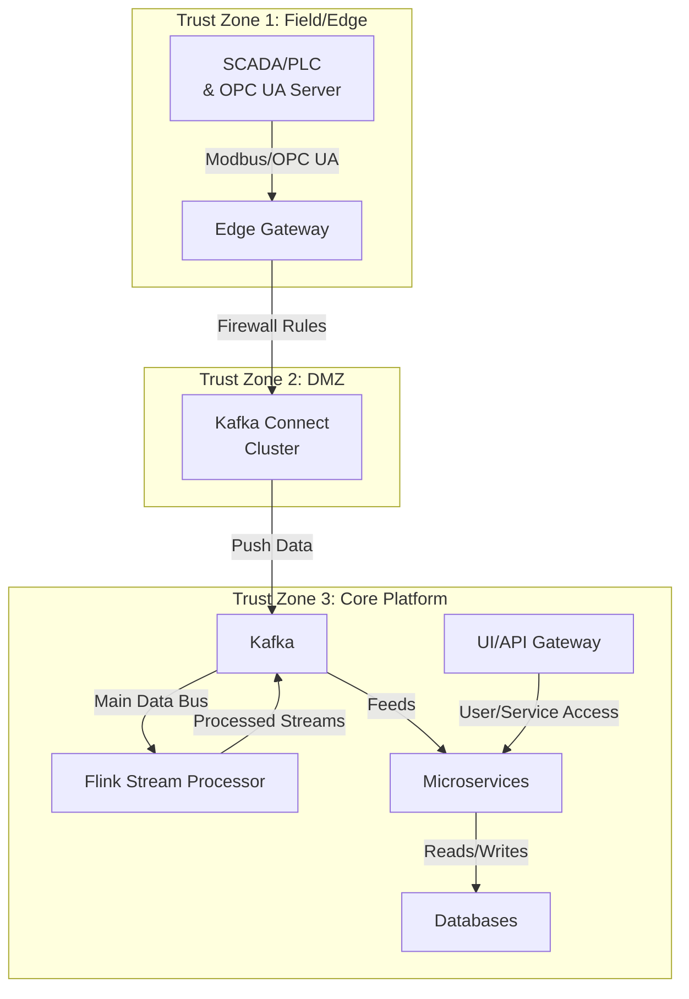
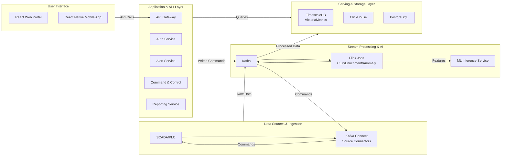

Based on your detailed requirements, here is a comprehensive **Software Requirements Specification (SRS)** document in English, followed by requested **Mermaid diagrams** illustrating the system architecture.

***

## **Software Requirements Specification (SRS): Real-Time Monitoring & Analytics Platform for Oil & Gas Fields**

**Version:** 1.0
**Date:** October 26, 2023
**Status:** Draft

### **0. Introduction & Scope**

#### **0.1 Project Overview**
This document specifies the requirements for a Real-Time Monitoring & Analytics Platform designed for an on-premise, air-gapped oil and gas field environment. The system leverages a Kubernetes cluster and Apache Flink for stream processing to enable real-time monitoring, anomaly detection, predictive failure, production optimization, and secure control.

#### **0.2 Deployment Environment**
*   **Environment:** On-Premise Kubernetes Cluster
*   **Connectivity:** Air-Gapped (Isolated from public internet)
*   **Key Technology Choices:**
    *   Container Orchestration: Kubernetes
    *   Stream Processing: Apache Flink (with Exactly-Once semantics and Backpressure handling)

#### **0.3 Goals & Objectives**
*   **Real-Time Monitoring:** Provide a single pane of glass for all field operations.
*   **Anomaly Detection:** Automatically identify abnormal equipment behavior and process deviations.
*   **Predictive Failure:** Forecast equipment failures to enable predictive maintenance.
*   **Production Optimization:** Provide insights to maximize production efficiency and recovery.
*   **Alerting & Control:** Generate timely alerts and enable secure, auditable control commands.

#### **0.4 Stakeholders & Roles**
| Role | Responsibilities | System Access |
| :--- | :--- | :--- |
| **System Admin** | Manages users, roles, security policies, and platform infrastructure. | Full system access for administration. |
| **Field Operator** | Monitors real-time data, acknowledges alerts, executes control commands with authorization. | Dashboards, alert center, control panels (with permissions). |
| **Data/Production Engineer** | Performs deep analysis, configures models/thresholds, generates reports. | Analytical dashboards, model management interfaces, reporting tools. |
| **Viewer** | Views operational dashboards and published reports. | Read-only access to designated dashboards and reports. |

***

### **1. System Architecture**

#### **1.1 High-Level Trust Zone Architecture**
The system is segmented into trust zones to enforce security boundaries.

**Key Security & Governance:**
*   **Network Segmentation:** Strict firewall rules between zones (Z1, Z2, Z3). Only authorized flows are permitted.
*   **Time Synchronization:** NTP/PTP across all nodes to ensure event correlation and prevent clock skew.
*   **Data Schema Governance:** Mandatory use of Kafka Schema Registry (Avro/Protobuf) for all data contracts.
*   **Reliability:** Implementation of Dead Letter Queues (DLQ), retry mechanisms, idempotency, and Exactly-Once processing in Flink.

***

### **2. Functional Requirements**

#### **2.1 Connectivity to SCADA/PLC**
| ID | Requirement | Acceptance Criteria |
| :--- | :--- | :--- |
| **FR-1** | The system shall securely read data from OPC UA servers and Modbus TCP endpoints. | Connection establishment time ≤ 2 seconds. Reading 100 data tags ≤ 2 seconds. |
| **FR-2** | The system shall support writing control commands back to SCADA/PLC via OPC UA. | Command execution requires two-factor approval and full audit logging. |

#### **2.2 Data Ingestion & Stream Processing**
| ID | Requirement | Acceptance Criteria |
| :--- | :--- | :--- |
| **FR-3** | Ingest data streams into the central Kafka bus. | Kafka Topics must include: `raw-sensor-data`, `processed-data`, `alerts`, `control-commands`, `dlq`. |
| **FR-4** | Apache Flink shall perform real-time data processing. | Processing includes: data cleansing, validation, enrichment (e.g., with tag metadata), Complex Event Processing (CEP), noise reduction, and attaching data quality flags. |
| **FR-5** | Processed data shall be persisted to long-term storage. | Connectors must sink data to Time-Series Database (TSDB) and Data Warehouse (DW). |

#### **2.3 AI/ML Inference & Analytics**
| ID | Requirement | Acceptance Criteria |
| :--- | :--- | :--- |
| **FR-6** | A dedicated microservice shall provide low-latency model inference. | Inference service exposes gRPC/HTTP endpoints. P95 inference latency < 50ms. |
| **FR-7** | The system shall perform real-time failure prediction and anomaly detection. | Model accuracy for failure prediction ≥ 0.85. Models are versioned and support rollback. |

#### **2.4 Alerting & Control Commands**
| ID | Requirement | Acceptance Criteria |
| :--- | :--- | :--- |
| **FR-8** | The system shall generate alerts from both threshold-based rules and AI-driven anomalies. | Alerts are routed based on severity/type (Email, SMS, Slack, SCADA Event Log). Alert de-duplication is required. |
| **FR-9** | Control commands shall be role-based and require authorization. | Critical commands require two-person approval. A full, tamper-proof audit trail of all command attempts is mandatory. |

#### **2.5 Visualization & User Experience**
| ID | Requirement | Acceptance Criteria |
| :--- | :--- | :--- |
| **FR-10** | A web portal shall provide comprehensive operational views. | Portal built with React+TypeScript. Integrates OIDC for auth, RBAC, real-time dashboards (embedded Grafana), alert center, and a well-head map. |
| **FR-11** | A mobile application shall be available for field operators. | App built with React Native. Supports offline mode with secure data synchronization upon reconnection. |

***

### **3. Non-Functional Requirements (NFRs)**

| Category | Requirement | Service Level Objective (SLO) |
| :--- | :--- | :--- |
| **Availability** | Core services must be highly available. | ≥ 99.9% uptime for critical services (Kafka, Flink, API Gateway, DBs). |
| **Performance** | Data must be available for monitoring with low latency. | End-to-End latency (SCADA → Dashboard) P95 ≤ 5 seconds. |
| **Throughput** | The system must handle high-volume sensor data. | Sustain a throughput of ≥ 100,000 metrics/minute. |
| **Resilience** | The system must recover quickly from failures. | RPO (Recovery Point Objective) ≤ 5 minutes. RTO (Recovery Time Objective) ≤ 15 minutes. |
| **Security** | The system must adhere to industrial security standards. | Comply with IEC 62443. Implement Zero-Trust principles, mTLS for all service-to-service communication, signed container images, and regular vulnerability scans. |
| **Scalability** | The system must scale to accommodate load increases. | Horizontal scaling for Kafka, Flink, and API services. Auto-scaling based on metrics like Kafka consumer lag and CPU utilization. |

***

### **4. Technical Architecture & Data Flow**

#### **4.1 Microservices Ecosystem & Data Flow**
The following diagram details the core components and how data moves through the system.

**Microservices Description:**
*   **API Gateway:** Single entry point for all UI and API requests.
*   **Auth Service:** Handles OIDC/OAuth2, RBAC/ABAC, mTLS, and session management.
*   **Data Ingestion Service:** Manages connectors, schema validation, and DLQ handling.
*   **Stream Processor (Flink):** Executes core streaming logic (cleansing, CEP, anomaly detection).
*   **ML Inference Service:** Hosts versioned models for real-time predictions.
*   **Alert Service:** Manages alert rules, de-duplication, escalation, and silencing.
*   **Reporting Service:** Generates periodic and on-demand analytical reports.
*   **Command & Control Service:** Manages the command queue, two-factor approval, and status feedback.
*   **Tag Catalog Service:** Central repository for well/tag metadata, units, and valid ranges.
*   **Digital Twin Service:** Hosts engineering calculations and process simulations.

#### **4.2 Data Storage Architecture**
| Purpose | Technology | Justification |
| :--- | :--- | :--- |
| **Time-Series Data** | TimescaleDB / VictoriaMetrics | Optimized for high-write throughput and time-based queries. |
| **Analytical DW** | ClickHouse | Fast SQL queries for aggregations and complex reports. |
| **Data Lakehouse** | Apache Iceberg on Object Storage | Open format for cost-effective historical data storage and advanced AI. |
| **Metadata & Transactions** | PostgreSQL | Relational store for users, tags, alerts, audit logs. |

#### **4.3 Data Governance**
*   **Schema Management:** Mandatory Schema Registry. All schema changes are versioned and backward-compatible.
*   **Data Quality:** "Great Expectations" framework integrated into Flink jobs. Each record carries a data quality tag.
*   **Data Lineage:** Track data origin and transformation using OpenLineage/Marquez.
*   **Data Retention:** Tiered retention policies (TTL, Compaction) based on data criticality and regulatory needs.

***

### **5. APIs & Contracts**

*   **Primary Protocols:** REST/JSON (API Gateway), gRPC (ML Inference, inter-service).
*   **API Design Principles:**
    *   **Idempotency-Key** for all POST/PUT calls.
    *   **Retry-After** headers for rate limiting.
    *   **Correlation-Id** for tracing requests across services.
    *   Standardized pagination and filtering.

***

### **6. DevOps & MLOps (On-Premise, Air-Gapped)**

#### **6.1 Infrastructure & CI/CD**
*   **Infrastructure as Code (IaC):** Terraform + Helm.
*   **GitOps:** ArgoCD for automated deployment synchronization.
*   **CI Pipeline:** Jenkins (internal mirror) with secure software supply chain: SBOM generation, container signing with Cosign/Sigstore.
*   **Container Registry:** Internal Harbor registry with Trivy/Grype vulnerability scanning.
*   **Kubernetes Security:** Network Policies, Pod Security Standards, OPA Gatekeeper, SPIFFE/SPIRE for service identity.
*   **Observability Stack:** OpenTelemetry (Traces → Tempo/Jaeger), Prometheus (Metrics), Loki (Logs). SLO dashboards in Grafana.
*   **Chaos Engineering:** LitmusChaos in staging environment.

#### **6.2 MLOps**
*   **Experiment Tracking:** MLflow.
*   **Model Registry:** MLflow Model Registry.
*   **Feature Store:** Feast with scheduled materialization for training and inference.
*   **Model Deployment:** BentoML/Seldon Core on Kubernetes. Support for Canary, Shadow, and A/B testing deployments.
*   **Model Monitoring:** Monitor for concept drift, data skew, and performance degradation in production.
